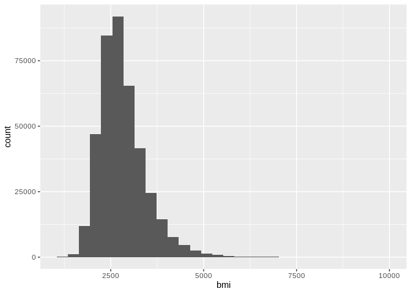
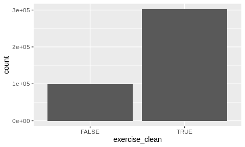
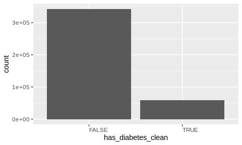

# Introduction
This analysis illustrates logistic regression.

Diabetes is one of the most common and costly chronic diseases. An estimated 23.1 million people in the United States are diagnosed with diabetes at a cost of more than $245 billion per year. (National Diabetes Statistics Report, 2017. Centers for Disease Control and Prevention. [https://www.cdc.gov/diabetes/pdfs/data/statistics/national-diabetes-statistics-report.pdf](https://www.cdc.gov/diabetes/pdfs/data/statistics/national-diabetes-statistics-report.pdf))

In this report I consider the question, are exercise level and body mass index predictive of diabetes? I wish to consider the potential effectiveness of health interventions such as exercise and weight control as diabetes risk mitigators.

## Set up
### Load R libraries

```r
library(psych)
library(ggplot2)
library(openintro)
library(lodown) # Anthony Damico's lodown package, available from GitHub; ajdamico/lodown.
```

### Download data
I downloaded the data once using this code and saved it. Execution of this code chunk is disabled.


```r
# Set download directory
dl_dir <- file.path(getwd())

# Get list of BRFSS files.
brfss_cat <-get_catalog("brfss", output_dir = dl_dir)
brfss_cat <- subset(brfss_cat, year == 2018)
# Download
brfss_cat <- lodown("brfss" , brfss_cat)
```

### Prepare data
I prepared the data for analysis with this code and saved the results to a file. Execution of this code chunk is disabled.


```r
brfss_df <- readRDS(file.path("data", "2018 main.rds"))
					
# There are a lot of columns in these data frames. This will subset the data 
# to include only the variables I am interested in and a few others I may
# consider in a future analysis. I also rename some columns to be more
# descriptive.
variables_to_keep <- c(
	"xstate", "fmonth", "imonth", "iday", "iyear",
	"genhlth", "exerany2",
	"sex1", "height3",
	"diabete3", "diabage2", "prediab1",
	"xageg5yr", "xage65yr", "htin4", "xbmi5", "xbmi5cat", "xrfbmi5"
)

brfss_df <- brfss_df[ variables_to_keep ]; gc()

names(brfss_df) <- c(
	"state", "file_month", "interview_month", "interview_day", "interview_year",
	"general_health", "exercise",
	"sex", "height",
	"has_diabetes", "diabetes_age", "is_prediabetic",
	"age", "is_65", "height_inches", "bmi", "bmi_category", "is_overweight_or_obese"
)

# Factors. Used code book and Emacs macros to build.

# state
state_labels <- c(
	"Alabama", "Alaska", "Arizona", "Arkansas", "California",
	"Colorado", "Connecticut", "Delaware", "District", "Florida",
	"Georgia", "Hawaii", "Idaho", "Illinois", "Indiana",
	"Iowa", "Kansas", "Kentucky", "Louisiana", "Maine",
	"Maryland", "Massachusetts", "Michigan", "Minnesota", "Mississippi",
	"Missouri", "Montana", "Nebraska", "Nevada", "New Hampshire",
	"New Jersey", "New Mexico", "New York", "North Carolina", "North Dakota",
	"Ohio", "Oklahoma", "Oregon", "Pennsylvania", "Rhode Island",
	"South Carolina", "South Dakota", "Tennessee", "Texas", "Utah",
	"Vermont", "Virginia", "Washington", "West Virginia", "Wisconsin",
	"Wyoming", "Guam", "Puerto Rico"
)

state_levels <- c(
	1, 2, 4, 5, 6, 8, 9, 10, 11, 12,
	13, 15, 16, 17, 18, 19, 20, 21, 22, 23,
	24, 25, 26, 27, 28, 29, 30, 31, 32, 33,
	34, 35, 36, 37, 38, 39, 40, 41, 42, 44,
	45, 46, 47, 48, 49, 50, 51, 53, 54, 55,
	56, 66, 72
)

brfss_df$state <- factor(brfss_df$state,
						 labels = state_labels,
						 levels = state_levels
						 )


# general_health
general_health_labels <- c(
	"Excellent",
	"Very good",
	"Good",
	"Fair",
	"Poor",
	"Don't know/Not sure",
	"Refused"
)
brfss_df$general_health <- factor(brfss_df$general_health,
								  labels = general_health_labels,
								  levels = c(1:5, 7, 9))

# exercise
exercise_labels = c(
	"Yes",
	"No",
	"Don’t know/Not sure",
	"Refused"
)
brfss_df$exercise <- factor(brfss_df$exercise,
								  labels = exercise_labels,
								  levels = c(1, 2, 7, 9))

# bmi_category
bmi_category_labels = c(
	"Underweight",
	"Normal weight",
	"Overweight",
	"Obese"
)
brfss_df$bmi_category <- factor(brfss_df$bmi_category,
								  labels = bmi_category_labels,
								  levels = c(1:4))

# has_diabetes
has_diabetes_labels <- c(
	"Yes",
	"Yes, female told only during pregnancy",
	"No",
	"No, pre-diabetes or borderline",
	"Don’t know/Not sure",
	"Refused"
)
brfss_df$has_diabetes <- factor(brfss_df$has_diabetes,
								labels = has_diabetes_labels,
								levels = c(1:4, 7, 9))

# Transform columns for logistic regression, cleaning categories.
#   has_diabetes: need two values, as factor. Insert NA where appropriate.
#   exercise: need two values. Insert NA where appropriate.
brfss_df <- brfss_df %>%
	mutate(
		has_diabetes_clean = case_when(
			has_diabetes == "Yes" ~ TRUE,
			has_diabetes == "Yes, female told only during pregnancy" ~ TRUE,
			has_diabetes == "No" ~ FALSE,
			has_diabetes == "No, pre-diabetes or borderline" ~ FALSE
			# ELSE NA
			),
		exercise_clean = case_when(
			exercise == "Yes" ~ TRUE,
			exercise == "No" ~ FALSE
			# ELSE NA
			)
	)

# Discard incomplete observations
brfss_is_complete <- complete.cases(brfss_df[, c("bmi",
												 "exercise_clean",
												 "has_diabetes_clean")])
brfss_df <- brfss_df[brfss_is_complete, ]

# Write file for analysis
saveRDS(brfss_df, file.path("data", "BRFSS_2018_subset.RDS"))
```

# Data

```r
brfss_df <- readRDS("BRFSS_2018_subset.RDS")
```

Data collection for the [Behavioral Risk Factor Surveillance System (BRFSS)](https://www.cdc.gov/brfss/) is a collaborative project between all of the states in the United States and participating US territories and the Centers for Disease Control and Prevention. The BRFSS is administered and supported by CDC's Population Health Surveillance Branch, under the Division of Population Health at the National Center for Chronic Disease Prevention and Health Promotion. The data are responses to questions from phone based surveys.

The cases are noninstitutionalized adults residing in the United States. There are 437,436 observations in the dataset.

The Centers for Disease Control and Prevention and the states of the U.S. and participating territories collected the data. CDC publish BRFSS data, and the annual results for year 2018 are available at:  [(https://www.cdc.gov/brfss/annual_data/annual_2018.html](https://www.cdc.gov/brfss/annual_data/annual_2018.html). For this project, data acquisition was facilitated by the R `lodown` package. Instructions for installing `lodown` are at: [http://asdfree.com/prnderequisites.html](http://asdfree.com/prnderequisites.html).

Citation: Centers for Disease Control and Prevention (CDC). Behavioral Risk Factor Surveillance System Survey Data. Atlanta, Georgia: U.S. Department of Health and Human Services, Centers for Disease Control and Prevention, 2018.

## Variables
The response variable is the case's answer to the survey question, "Have you ever been told you have diabetes?" The variable is categorical, or qualitative. The responses recorded in the dataset are:

- Yes
- Yes, female told only during pregnancy
- No
- No, pre-diabetes or borderline
- Don’t know/Not sure
- Refused

I transformed the two "Yes" responses to TRUE for having diabetes, the two "No" responses to FALSE, and assigned the remaining values to Not Available. I excluded from the analysis observations with a response variable value of Not Available.

The explanatory variables I consider are body mass index (BMI) and exercise.

- BMI is provided in the dataset as a numeric (quantitative) computed variable given by height and weight.
- Exercise is recorded as the case's answer to the survey question, "During the past month, other than your regular job, did you participate in any physical activities or exercises such as running, calisthenics, golf, gardening, or walking for exercise?". The responses recorded in the dataset are:
  - Yes
  - No
  - Don’t know/Not sure
  - Refused

I transformed the "Yes" responses for exercise to TRUE, the "No" responses to FALSE, and assigned the remaining exercise values to Not Available. I excluded from the analysis observations with a response variable value of Not Available.

This study is observational. It lacks a control group. It therefore cannot be regarded as an experiment, nor can it establish causal links between the variables.

BRFSS survey responses are collected by phone. I feel the study can be generalized to the adult U.S. population.

# Exploratory data analysis
## Body Mass Index
BMI presents a bell-shaped distribution. It's mean, 2827, lies to the right of the median, represented as the .50 percentile in its summary statistics with a value of 2728. This is consistent with the right skew evident in a histogram plot of the variable.

```r
describe(brfss_df$bmi)
```

```
##    vars      n    mean     sd median trimmed    mad  min  max range skew
## X1    1 401064 2826.51 637.65   2727 2764.25 538.18 1205 9873  8668 1.43
##    kurtosis   se
## X1     4.89 1.01
```

```r
ggplot(brfss_df, aes(x=bmi)) + geom_histogram()
```

```
## `stat_bin()` using `bins = 30`. Pick better value with `binwidth`.
```

<!-- -->

## Exercise
Exercise is a categorical variable. About 75% of respondents reported that they do exercise.

```r
table(brfss_df$exercise_clean, useNA='ifany')
```

```
## 
##  FALSE   TRUE 
##  99110 301954
```

```r
prop.table(table(brfss_df$exercise_clean, useNA='ifany')) * 100
```

```
## 
##    FALSE     TRUE 
## 24.71177 75.28823
```

```r
ggplot(brfss_df, aes(x=exercise_clean)) + geom_histogram(stat = "count")
```

```
## Warning: Ignoring unknown parameters: binwidth, bins, pad
```

<!-- -->

```r
	theme(axis.text.x = element_text(angle = 0, hjust = 0))
```

```
## List of 1
##  $ axis.text.x:List of 11
##   ..$ family       : NULL
##   ..$ face         : NULL
##   ..$ colour       : NULL
##   ..$ size         : NULL
##   ..$ hjust        : num 0
##   ..$ vjust        : NULL
##   ..$ angle        : num 0
##   ..$ lineheight   : NULL
##   ..$ margin       : NULL
##   ..$ debug        : NULL
##   ..$ inherit.blank: logi FALSE
##   ..- attr(*, "class")= chr [1:2] "element_text" "element"
##  - attr(*, "class")= chr [1:2] "theme" "gg"
##  - attr(*, "complete")= logi FALSE
##  - attr(*, "validate")= logi TRUE
```

```r
	# Justification 0 = left, 1 = right
```
## Diabetes
About 15% of the cases reported they have diabetes, signified by TRUE in the summaries and plot.

```r
table(brfss_df$has_diabetes_clean, useNA='ifany')
```

```
## 
##  FALSE   TRUE 
## 341925  59139
```

```r
prop.table(table(brfss_df$has_diabetes_clean, useNA='ifany')) * 100
```

```
## 
##    FALSE     TRUE 
## 85.25447 14.74553
```

```r
ggplot(brfss_df, aes(x=has_diabetes_clean)) + geom_histogram(stat = "count") +
	theme(axis.text.x = element_text(angle = 0, hjust = 0))
```

<!-- -->

Since the outcome, having diabetes, has two values, it is difficult to visualize its correlation with the explanatory variables. I proceed to inference and testing conditions.

# Inference
The response variable, representing having diabetes, is a categorical variable with two values. therefore, I turn to logistic regression for building a predictive model.

## Conditions
Logistic regression requires two key conditions.

1. Each outcome is independent of the other outcomes.
1. Each predictor is linearally related to logit(*p*) if all other predictors are held constant.

The first condition is reasonable for this observational study given the random sampling for phone interviews.

Next, I run the logistic regression model and plot the true incidence of diabetes against the model's fitted probabilities. Noise is added in the vertical dimension in order for points with nearly identical values not to be superimposed. 


```r
m <- glm(formula = has_diabetes_clean ~ bmi + exercise_clean,
		 family = binomial,
		 data = brfss_df)
p  <- predict(m, type = "response")

set.seed(1)
noise <- rnorm(nrow(brfss_df), sd = 0.08)
plot(p, brfss_df$has_diabetes_clean + noise,
     xlim = 0:1,
     ylim = c(-0.5, 1.5),
     axes = FALSE,
     xlab = "Predicted Probability",
     ylab = "",
     col = fadeColor(COL[1], "22"),
     pch = 20)
axis(1)
axis(2,
     at = c(0,1),
     labels = c("0 (No d.)", "1 (Has d.)"))
```

<!-- -->

I would like to assess the quality of the model. For example, for cases modelled as having a 10% chance of having diabetes, do 10% of them in fact have diabetes? I check this for groups of the data as follows:

1. Bucket the data into groups based on their predicted probabilities.
1. Compute the average predicted probability for each group.
1. Compute the observed probability for each group, along with a 95% confidence interval.
1. Plot the observed probabilities (with 95% confidence intervals) against the average predicted probabilities for each group.

The points plotted should fall close to the line y = x, since the predicted probabilities should be similar to the observed probabilities. I can use the confidence intervals to gauge roughly whether anything is amiss.

The points do fall quite closely to the line y = x. The linearity condition is satisfied.


```r
plot(p, brfss_df$has_diabetes_clean + noise / 5,
     type = "n",
     xlim = 0:1,
     ylim = c(-0.07, 1.07),
     axes = FALSE,
     xlab = "Predicted Probability",
     ylab = "")
par(las = 0)
mtext("Truth", 2, 5.5)
par(las = 1)
rect(0, 0, 1, 1,
     border = COL[6],
     col = "#00000000",
     lwd = 1.5)
lines(0:1, 0:1,
      lty = 2,
      col = COL[6],
      lwd = 1.5)
points(p, brfss_df$has_diabetes_clean + noise / 5,
       col = fadeColor(COL[1], "18"),
       pch = 20)
axis(1)
at <- seq(0, 1, length.out = 6)
labels <- c("0 (No d.)",
            "0.2  ",
            "0.4  ",
            "0.6  ",
            "0.8  ",
            "1 (Has d.)")
axis(2, at, labels)
eps <- 1e-4
bucket_breaks <- quantile(p, seq(0, 1, 0.01))
bucket_breaks[1] <- bucket_breaks[1] - eps
n_buckets <- length(bucket_breaks) - 1
bucket_breaks[n_buckets] <- bucket_breaks[n_buckets] + 1e3 * eps
bucket_breaks. <- bucket_breaks
k <- 1
for (i in 1:n_buckets) {
  if (abs(bucket_breaks.[i] - bucket_breaks[k]) >= 0.01) {
    k <- k + 1
    bucket_breaks[k] <- bucket_breaks.[i]
  }
}
bucket_breaks <- bucket_breaks[1:k]

n_buckets <- length(bucket_breaks)
xp <- rep(NA, n_buckets)
yp <- rep(NA, n_buckets)
yp_lower <- rep(NA, n_buckets)
yp_upper <- rep(NA, n_buckets)
zs <- qnorm(0.975)
for (i in 1:n_buckets) {
  these <- bucket_breaks[i] < p & p <= bucket_breaks[i + 1]
  xp[i] <- mean(p[these])
  y <- brfss_df$has_diabetes_clean[these]
  yp[i] <- mean(y)
  yp_lower[i] <- yp[i] - zs * sqrt(yp[i] * (1 - yp[i]) / length(y))
  yp_upper[i] <- yp[i] + zs * sqrt(yp[i] * (1 - yp[i]) / length(y))
}
points(xp, yp, pch = 19, cex = 0.7)
segments(xp, yp_lower, xp, yp_upper)
arrows(0.3, 0.17,
       0.24, 0.22,
       length = 0.07)
text(0.3, 0.15,
    paste("Observations are bucketed,",
        "then I compute the observed probability in each bucket (y)",
        "against the average predicted probability (x)",
        "for each of the buckets with 95% confidence intervals.",
        sep = "\n"),
    cex = 0.85, pos = 4)
```

<!-- -->
## Model summary

```r
summary(m)
```

```
## 
## Call:
## glm(formula = has_diabetes_clean ~ bmi + exercise_clean, family = binomial, 
##     data = brfss_df)
## 
## Deviance Residuals: 
##     Min       1Q   Median       3Q      Max  
## -2.7746  -0.5742  -0.4704  -0.4004   2.5621  
## 
## Coefficients:
##                      Estimate Std. Error z value Pr(>|z|)    
## (Intercept)        -3.538e+00  2.212e-02 -159.99   <2e-16 ***
## bmi                 7.543e-04  6.563e-06  114.94   <2e-16 ***
## exercise_cleanTRUE -6.160e-01  9.730e-03  -63.31   <2e-16 ***
## ---
## Signif. codes:  0 '***' 0.001 '**' 0.01 '*' 0.05 '.' 0.1 ' ' 1
## 
## (Dispersion parameter for binomial family taken to be 1)
## 
##     Null deviance: 335506  on 401063  degrees of freedom
## Residual deviance: 315605  on 401061  degrees of freedom
## AIC: 315611
## 
## Number of Fisher Scoring iterations: 4
```

The predictors are `bmi` and `exercise_cleanTRUE`. The categorical variable, `exercise_clean` yields an implied reference variable representing falsity, and the dummy variable, `exercise_cleanTRUE`'. The p values for the predictors are smaller than machine precision reportability, at <2e-16, which implies body mass index and exercise play statistically significant roles in the incidence of diabetes.

The coefficient for `bmi` is positive and for `exercise_cleanTRUE` is negative, implying that increase in body mass index increases probability of diabetes while the behavior of exercising vs. not exercising reduces the probability of diabetes. Each rise of one point of BMI raises the probability of diabetes by 0.0008. Adoption of exercise reduces the probability of diabetes by 0.6160.

# Conclusion
Excessive weight plays a role in increasing the probability of diabetes. Exercise reduces it. I expected results like these, but I was surprised by the magnitude of the reduction related to exercise, over 60%.

# Further study
- Is exercise a confounder for weight, or does it have benefits which lower the risk of diabetes irrespective of weight? A controlled study to isolate these variables might yield more understanding.
- More modelling of the variables from BRFSS might reveal other predictors of diabetes just within this dataset. Backward elimination and forward selection might lead to a model even more predictive.
- Experiments (in contrast to this observational study) could yield causal mechanisms for diabetes.
- Actually, I believe such experiments have been done. For example, we know a lot about the role of insulin spiking in causing Type II diabetes. It's why I rarely consume refined sugar.

# References
- Centers for Disease Control and Prevention (CDC). Behavioral Risk Factor Surveillance System Survey Data. Atlanta, Georgia: U.S. Department of Health and Human Services, Centers for Disease Control and Prevention, 2018.
- Centers for Disease Control and Prevention (CDC). National Diabetes Statistics Report, 2017. [https://www.cdc.gov/diabetes/pdfs/data/statistics/national-diabetes-statistics-report.pdf](https://www.cdc.gov/diabetes/pdfs/data/statistics/national-diabetes-statistics-report.pdf)
- Anthony Damico. `lodown` R package. [https://github.com/ajdamico/lodown](https://github.com/ajdamico/lodown)
